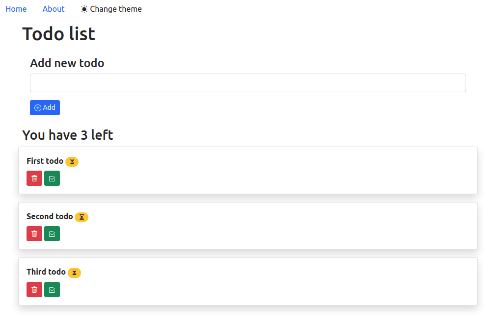

# Todo App

This repo contains an example of web application using [Svelte](https://svelte.dev/), the app uses different feature of the framework: Components, Events, Form and Routing.




## Run

```
$ npm install 

$ npm start
```
